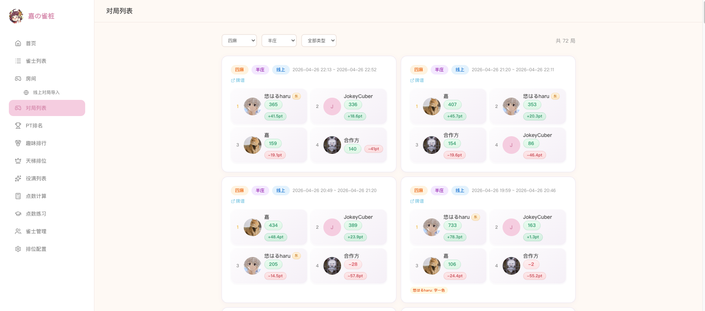

<p align="center">
  <h1 align="center">嘉の雀桩</h1>
  <p align="center">
    <strong>Mahjong Game Recorder</strong><br/>
    Offline scoring &middot; Mahjong Soul paipu import &middot; Stats &amp; ranking
  </p>
  <p>
    
    
    
    
  </p>
  <p align="center">
    <a href="README.md">中文</a> &middot;
    <a href="README.en.md">English</a> &middot;
    <a href="README.ja.md">日本語</a>
  </p>
</p>



---

## Features

### Player Management
- Create, edit, and delete players
- Link Mahjong Soul accounts (UID → player auto-matching)
- Player profiles: PT curves, rank distribution, yakuman records

### Offline Games
- Create rooms, manage room members
- Support **3-player / 4-player**, **East-only / Half-match**
- Automatic score sum validation (4P = 1000, 3P = 1050)
- One-click random seat assignment (East / South / West / North)
- Quick copy players from previous game

### Mahjong Soul Paipu Import
- Batch paste paipu URLs with automatic parsing
- Fetch game details (start/end time, player scores) locally via Mahjong Soul WebSocket protocol
- Auto-match Mahjong Soul UIDs to bound players, one-click create &amp; link for unbound UIDs
- Rate-limited to 20 requests/minute to avoid triggering rate limits
- Duplicate link detection to prevent re-importing

### Stats &amp; Ranking
- **PT Ranking** — Automatic PT calculation with leaderboard
- **Fun Rankings** — 1st place rate, average rank, highest/lowest score, etc.
- **Player Stats** — Rank distribution, total PT, recent N games rank trend &amp; cumulative PT curves, filterable by offline/online

### Yakuman Records
- Record yakuman hands (tiles, melds, win type)
- Yakuman gallery with filtering by type

### Tier System
- Custom tiers (name, score, promotion/demotion rules)
- Auto-calculated tier scores with real-time ranking

### More
- **Score Calculator** — Manual hand score calculation
- **Yaku Practice** — Interactive yaku training
- **Public Browsing** — Everyone can view pages; only admins can modify

---

## Tech Stack

| Layer | Tech |
|:-----:|:----:|
| Backend | Python / Django 5.x / Django REST Framework / SQLite |
| Frontend | React 19 / TypeScript / Vite / Tailwind CSS |
| Paipu | Node.js / WebSocket / Protobuf (Mahjong Soul protocol) |
| Proxy | Node.js / http-proxy (unified port) |

## Project Structure

```
Mahjong/
├── Makefile                  # One-click start, env check, service management
├── proxy.cjs                 # Unified reverse proxy (port 9999)
├── backend/                  # Django backend
│   ├── config/               # Django project config
│   ├── apps/users/           # User authentication
│   ├── apps/players/         # Player management
│   ├── apps/games/           # Game management (rooms + games + paipu)
│   ├── apps/ranking/         # Tier ranking
│   ├── services/             # Business services (Mahjong Soul paipu parser)
│   ├── majsoul_node/         # Mahjong Soul paipu Node script
│   ├── db_config.json        # Local config (not committed)
│   └── db_config.example.json
└── frontend/                 # React frontend
    └── src/
        ├── api/              # API request layer
        ├── pages/            # Page components
        ├── components/       # Shared components
        └── layouts/          # Layouts
```

## Quick Start

### Prerequisites

- Python 3.12+
- Node.js 18+ (with npm)
- Make

### Installation

```bash
git clone <repo-url>
cd Mahjong

# Check environment and install dependencies
make env

# Initialize database + create admin
# Default credentials: admin / admin123
# Override with: ADMIN_USER=xxx ADMIN_PASS=xxx make init
make init
```

### Start

```bash
make dev
```

| URL | Service |
|:---:|:-------:|
| http://localhost:9999 | Unified entry (recommended) |
| http://localhost:9998 | Frontend dev server |
| http://localhost:9997 | Backend API |

### Common Commands

| Command | Description |
|:-------:|:-----------:|
| `make dev` | Start dev backend + frontend |
| `make prod` | Build and deploy production (Linux systemd service) |
| `make prod-stop` | Stop and remove production systemd service |
| `make mortal` | Run Mortal AI in background (dev / non-Linux) |
| `make mortal-prod` | Install Mortal AI systemd service (Linux) |
| `make mortal-prod-stop` | Stop and remove Mortal systemd service |

### Production (Linux)

Run from the project directory; systemd units use the **current checkout path** as the working directory:

```bash
cp backend/db_config.example.json backend/db_config.json
make prod
make mortal-prod   # optional; configure mortal-server/config.toml first
```

Stop and remove services:

```bash
make prod-stop
make mortal-prod-stop
```

Logs: app → `logs/mahjong-prod.log`; Mortal → `journalctl -u mahjong-mortal.service -f`.

On non-Linux (e.g. macOS), `make prod` / `make mortal` use background processes instead.

## Configuration

### Database &amp; Mahjong Soul Account

Edit `backend/db_config.json` (copy from `db_config.example.json`):

```json
{
    "database": {
        "sqlite_path": "db.sqlite3"
    },
    "majsoul_account": "your_account",
    "majsoul_password": "your_password"
}
```

- `sqlite_path`: Relative to `backend/`, or use an absolute path
- `majsoul_account` / `majsoul_password`: Used to fetch paipu details via Mahjong Soul WebSocket protocol
- This file is in `.gitignore` and will not be committed

> Can also be overridden via environment variables `MAJSOUL_ACCOUNT` / `MAJSOUL_PASSWORD`

### Node Dependencies for Paipu

Before using the paipu import feature, install Node dependencies:

```bash
cd backend/majsoul_node && npm install
```

## Scoring Rules

### Scores

- **4-player games**: Score sum = 1000
- **3-player games**: Score sum = 1050
- Scores are integers and can be negative
- One player must be designated as the initial East dealer

### PT Calculation

| Rank | 4 Players | 3 Players |
|:----:|:---------:|:---------:|
| 1st | +30 | +30 |
| 2nd | +10 | 0 |
| 3rd | -10 | -30 |
| 4th | -30 | — |

## Admin

- Click "Admin Login" in the top-right corner of the page
- Admins can perform all write operations (create rooms, record scores, manage players, etc.)
- Others can freely browse all pages
- Create an admin via Django command:

```bash
cd backend
.venv/bin/python manage.py createsuperuser
```

## License

[MIT](LICENSE)

---

<p align="center">
  <a href="README.md">中文</a> &middot;
  <a href="README.en.md">English</a> &middot;
  <a href="README.ja.md">日本語</a>
</p>
